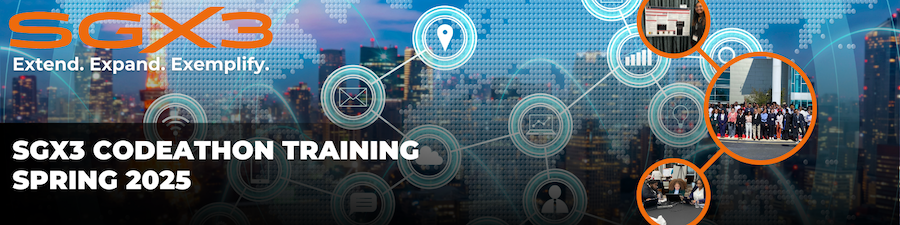

## About 

This event is operated by the ECSU Center of Excellence in Remote Sensing Education and Research (CERSER) and the SGX3 Center of Excellence (https://sciencegateways.org). The purpose is to advance undergraduate professional development by providing career pathways into the high-performance computing world of Science Gateways!

## When

The first virtual training will be on Wednesday, January 15th, 2025 at 6:00 pm ET and will continue weekly through April 9, 2025. At the first meeting, we will discuss logistics and the task sheet for Spring 2025. The training sessions will be led by Mr. Je’aime Powell of Omnibond Systems.

